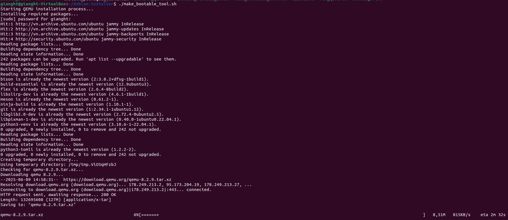
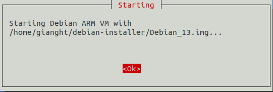
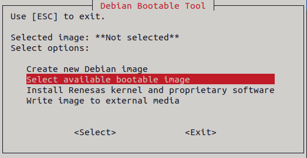
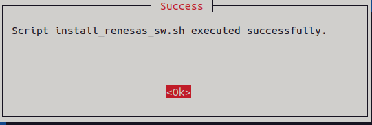
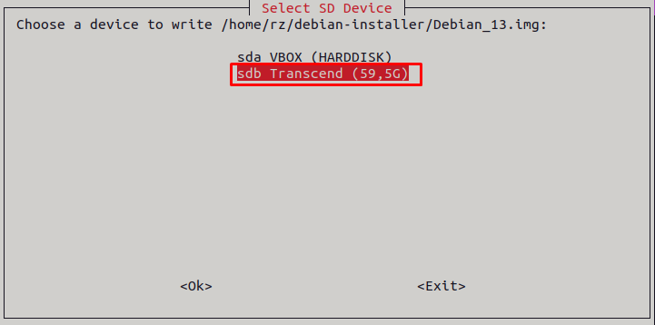
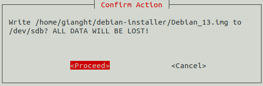
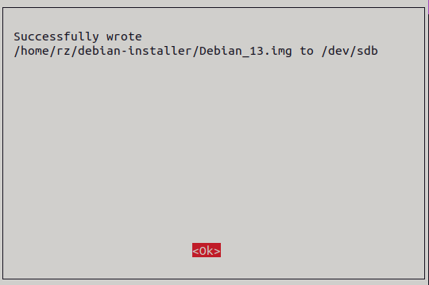
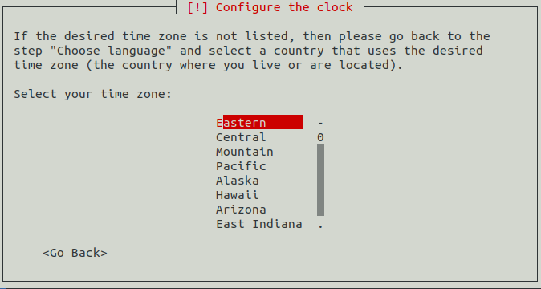
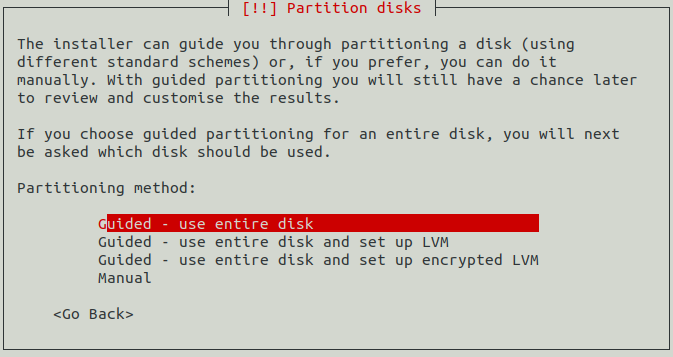
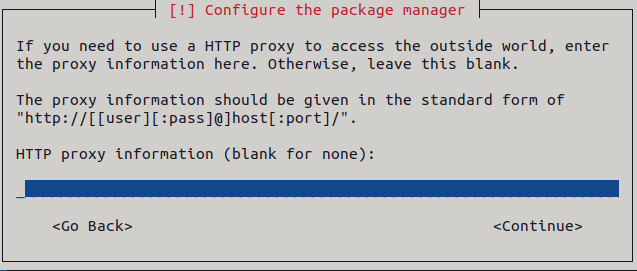

# Debian Bootable Tool

## 1. Overview

The **Debian Bootable Tool** is a Bash script designed to streamline the creation and customization of bootable ARM64 Linux disk images for Debian 13 on the RZ/G platforms. It offers a user-friendly, menu-based interface using `whiptail` and `zenity`, making it easy to create and apply custom configurations. The tool also supports writing images directly to an external media (e.g., SD card).

## 2. Objectives

- **Prepare The Image**:
  - Use an existing image or create a new image.
  - Download Debian 13 ARM64 ISO if it doesn't exist already.
  - Use QEMU to install Debian 13 to the image.

- **Install Software Packages**:
  - Install OSS (Open Source Software) packages including: CIP kernel, GStreamer, MMNGR, VSPMIF.
  - Install HW Graphics packages (optional).
  - Install HW Codecs packages (optional).

- **Write The Image**:
  - Select and write the image to an external media (e.g., SD card).

## 3. Scripts Details

Split into smaller scripts for easier maintenance. The following introduces the scripts and their main functions:

- `make_bootable_image.sh`: Contain the main menu selection.
- `install_qemu.sh`: Install QEMU version 8.2.9.
- `run_qemu.sh`: Start QEMU VM to install Debian 13 to the image.
- `install_renesas_sw.sh`: Set up chroot environment to install software packages.
- `install_packages_debian.sh`: Install .deb packages.
- `write_image.sh`: Write the image to an external media (e.g., SD card).
- `settings.txt`: Contain user settings.

## 4. Usage

### 4.1 Prerequisites

- Supported OS: Ubuntu 22.04 LTS or 24.04 LTS.
  - Internet connection is required.
  - The sudo permission is required.
- Tested hardware:
  - Processor: Intel Core i5-7400 (4 cores, 4 threads).
  - RAM: 8 GB.
  - Storage: Minimum 50 GB available.
- External media: At least 32 GB (e.g., microSD card).

### 4.2 How To Use

- Execute "./make_bootable_image.sh" to open the GUI:

  ```bash
  ./make_bootable_image.sh
  ```

- The main menu provides 4 options:
  - [Create new Debian image.](#421-create-new-debian-image)
  - [Select available bootable image.](#422-select-available-bootable-image)
  - [Install Renesas kernel and proprietary software.](#423-install-renesas-kernel-and-proprietary-software)
  - [Write image to external media.](#424-write-image-to-external-media)

  

#### 4.2.1 Create new Debian image

- Press Enter on the "Create new Debian image".

  

- Use the file dialog to name the image (e.g., Debian_13.img) and select its location. Next, press "OK" to confirm.

  

- Enter administrator password. The tool will then download, build, and install QEMU version 8.2.9. If it's already installed, this step will be skipped.

  

- The tool will allocate and format `Debian_13.img`.

  

- The tool will download the Debian 13 ISO. If it already exists in the `downloads` folder, this step will be skipped.

  

  

- The tool will use QEMU VM to install Debian 13 on `Debian_13.img`. Press "Ok" to continue.

  

- Follow installation instructions in [Section 4.3](#43-how-to-install-debian-13).

- If successful, the "Completed" dialog box will appear. Press "Ok" to continue.

  

- The new image will now appear as the "Selected image" in the main menu.

  

#### 4.2.2 Select available bootable image

- Press Enter on the "Select available bootable image".

  

- Use the file dialog to select the image (e.g., Debian_13.img). Next, press "OK" to confirm.

  

- Once selected, the image will appear as the "Selected image" in the main menu.

  

#### 4.2.3 Install Renesas kernel and proprietary software

- Please [create](#421-create-new-debian-image) or [select](#422-select-available-bootable-image) an image first.

- Press Enter on the "Install Renesas kernel and proprietary software".

  

- Enter administrator password. The tool will then install all .deb packages into the selected image.

  

- Wait for the dialog box below to appear, then click 'Ok' to continue..

  

#### 4.2.4 Write image to external media

- **Note:** In this guide, we use a microSD card to illustrate the steps.

- Please [create](#421-create-new-debian-image) or [select](#422-select-available-bootable-image) an image first.

- Plug in the microSD card to the Host PC.

- Press Enter on the "Write image to external media".

  

- Select the microSD card (e.g., "sdb Transcend (59,5G)"). Press "Ok" to continue.

  

- Press "Proceed" to confirm.

  

- The tool will write `Debian_13.img` to `sdb Transcend (59,5G)`. Wait until the image is written.

  

- If successful, the following dialog box will appear. Press "Ok" to continue.

  

- Press "Save and Exit" to save the settings. Then press "Ok" to exit.

  

  

  

- Execute "sudo eject /dev/sdb" to safely remove the microSD card from the Host PC.

#### 4.2.5 Edit settings.txt (optional)

##### 4.2.5.1 ISO_URLS

- The `ISO_URLS` specifies the download links for the ISO file.

- By default, it points to the `Debian 13.2.0 arm64 ISO` hosted on the official release site.

##### 4.2.5.2 IMAGE_SIZE

- The `IMAGE_SIZE` specifies the size of the image to be created.

- By default, it will be 16 GB (16000000000 bytes).

- **Important:** The image size must be at least 10 GB.

### 4.3 How To Install Debian 13

- Press Enter on "Install".

  

- Press Enter on "English".

  

- Select your country, territory or area (e.g., "United States").

  

- Select your keyboard configuration (e.g., "American English").

  

- Edit the hostname (example: debian), then press "Continue".

  

- Enter the domain name, then press "Continue" (leave blank if not applicable).

  

- Set and verify the root password.

  

  

- Create user account (e.g., "rvc").

  

  

  

  

- Select your time zone (e.g., "Eastern").

  

- Press Enter on "Guided - use entire disk".

  

- Press Enter on "Virtual disk 1 (vda) - 16.0 GB Virtio Block Device".

  

- Press Enter on "All files in one partition (recommended for new users)".

  

- Press Enter on "Finish partitioning and write changes to disk", then confirm with "Yes".

  

  

- Press "Yes" to update the software using network mirror.

  

- Select archive mirror country (e.g., "United States").

  

- Press Enter on "deb.debian.org".

  

- Edit HTTP proxy information (leave blank if not applicable), then press "Continue".

  

- Press "No" to skip the package usage survey.

  

- Do not select any desktop environment. Press "Continue" to proceed.

  

- If successful, the "Installation complete" dialog box will appear. Click "Continue" to exit the installer.

  

- At GRUB interface, press `Ctrl-A X` to exit the VM.

  

## 5. Common issues

### 5.1 Unable to download ISO file

- If the installer fails to download the ISO file, it may show an error message:

  

- For quick fix, find a valid URL for `debian-13.2.0-arm64-DVD-1.iso` from the [Debian CD/DVD archive](https://cdimage.debian.org/mirror/cdimage/archive/) or other trusted sources, then [update the value of ISO_URLS accordingly](#4251-iso_urls).

### 5.2 Missing bmap file causes slow write speed

- The installer uses .bmap file to accelerate the write speed when writing the image to external media. Without the .bmap file, it will fall back to nobmap mode, resulting in significantly slower write performance because the entire image must be written block by block.

  

- When the image is compressed or transferred (e.g., uploaded to a server or shared with others), [its sparse regions (holes)](https://github.com/yoctoproject/bmaptool?tab=readme-ov-file#sparse-files) are filled with zeros. As a result, generating a new .bmap file afterward becomes meaningless and will no longer accelerate the write speed. To ensure fast writing and correct handling on other systems, always keep and distribute the image together with its corresponding .bmap file.
