# Ubuntu Bootable Tool

## 1. Overview

The **Ubuntu Bootable Tool** is a Bash script designed to streamline the creation and customization of bootable ARM64 Linux disk images for Ubuntu 24.04 on the RZ/G platforms. It offers a user-friendly, menu-based interface using `whiptail` and `zenity`, making it easy to create, and apply custom configurations. The tool also supports writing images directly to an external media (e.g., SD card).

## 2. Objectives

- **Prepare The Image**:
  - Use an existing image or create a new image.
  - Download Ubuntu 24.04 ARM64 ISO if it doesn't exist already.
  - Use QEMU to install Ubuntu 24.04 to the image.

- **Install Software Packages**:
  - Install OSS (Open Source Software) packages including: CIP kernel, GStreamer, MMNGR, VSPMIF.
  - Install HW Graphics packages (optional).
  - Install HW Codecs packages (optional).

- **Write The Image**:
  - Select and write the image to an external media (e.g., SD card).

## 3. Scripts Details

Split into smaller scripts for easier maintenance. The following introduces the scripts and their main functions:

- `make_bootable_image.sh`: Contain the main menu selection.
- `install_qemu.sh`: Install QEMU version 8.2.9.
- `run_qemu.sh`: Start QEMU VM to install Ubuntu 24.04 to the image.
- `install_renesas_sw.sh`: Set up chroot environment to install software packages.
- `install_packages_ubuntu.sh`: Install .deb packages.
- `write_image.sh`: Write the image to an external media (e.g., SD card).
- `settings.txt`: Contain user settings.

## 4. Usage

### 4.1 Prerequisites

- Supported OS: Ubuntu 22.04 LTS or 24.04 LTS.
  - Internet connection is required.
  - The sudo permission is required.
- Tested hardware:
  - Processor: Intel Core i5-7400 (4 cores, 4 threads).
  - RAM: 8 GB.
  - Storage: Minimum 50 GB available.
- External media: At least 32 GB (e.g., microSD card).

### 4.2 How To Use

- Run the main script:

  ```bash
  ./make_bootable_image.sh
  ```

- The main menu provides 4 options:

  - [**Create new Ubuntu image.**](#421-create-new-ubuntu-image)
  - [**Select available bootable image.**](#422-select-available-bootable-image)
  - [**Install Renesas kernel and proprietary software.**](#423-install-renesas-kernel-and-proprietary-software)
  - [**Write image to external media.**](#424-write-image-to-external-media)

  

#### 4.2.1 Create new Ubuntu image

- Press Enter on the "Create new Ubuntu image".

  

- Use the file dialog to name the image (e.g., Linux.img) and select its location. Next, press "OK" to confirm.

  

- Enter administrator password. The tool will then download, build, and install QEMU version 8.2.9. If it's already installed, this step will be skipped.

  

- The tool will allocate and format `Linux.img`.

  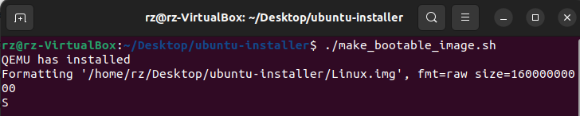

- The tool will download the Ubuntu 24.04 ISO. If it already exists in the `downloads` folder, this step will be skipped.

  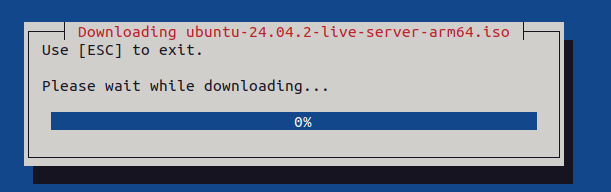

  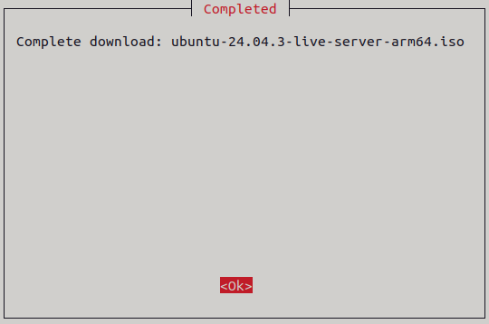

- The tool will use QEMU VM to install Ubuntu 24.04 to `Linux.img`. Press "Ok" to continue.

  

- Follow installation instructions in [Section 4.3](#43-how-to-install-ubuntu-2404).

- If successful, the "Completed" dialog box will appear. Press "Ok" to continue.

  

- The new image will now appear as the "Selected image" in the main menu.

  

#### 4.2.2 Select available bootable image

- Press Enter on the "Select available bootable image".

  

- Use the file dialog to select the image (e.g., Linux.img). Next, press "OK" to confirm.

  

- Once selected, the image will appear as the "Selected image" in the main menu.

  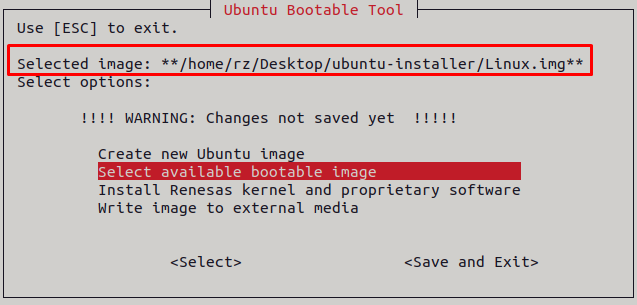

#### 4.2.3 Install Renesas kernel and proprietary software

- Please [create](#421-create-new-ubuntu-image) or [select](#422-select-available-bootable-image) an image first.

- Press Enter on the "Install Renesas kernel and proprietary software".

  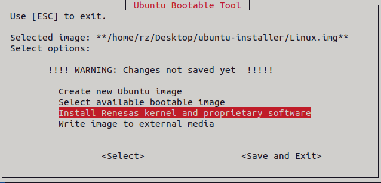

- The tool will install all .deb packages into `Linux.img`.

  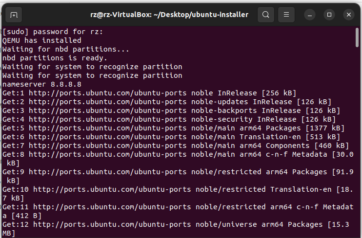

- Wait for the dialog box below to appear, then click 'Ok' to continue.

  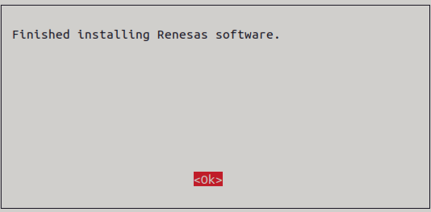

#### 4.2.4 Write image to external media

- **Note:** In this guide, we use a microSD card to illustrate the steps.

- Please [create](#421-create-new-ubuntu-image) or [select](#422-select-available-bootable-image) an image first.

- Plug in the microSD card to the Host PC.

- In the main menu, press Enter on "Write image to external media" to write `Linux.img` to the microSD card.

  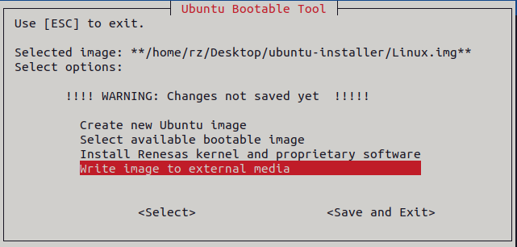

- Select the microSD card (e.g., "sdb Transcend (59,5G)"). Press "Ok" to continue.

  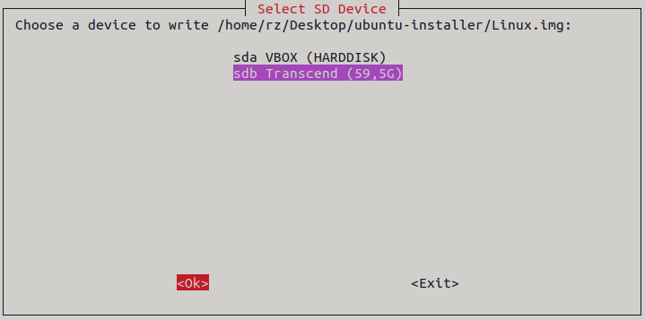

- Press "Proceed" to confirm.

  

- The tool will write `Linux.img` to `sdb Transcend (59,5G)`.

  

- If successful, the following dialog box will appear. Press "Ok" to continue.

  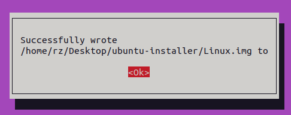

- Execute "sudo eject /dev/sdb" to safely remove the microSD card from the Host PC.

#### 4.2.5 Edit settings.txt (optional)

##### 4.2.5.1 ISO_URLS

- The `ISO_URLS` specifies the download links for the ISO file.

- By default, it points to the `Ubuntu 24.04.3 LTS arm64 ISO` hosted on the official release site.

##### 4.2.5.2 IMAGE_SIZE

- The `IMAGE_SIZE` specifies the size of the image to be created.

- By default, it will be 16 GB (16000000000 bytes).

- **Important:** The image size must be at least 10 GB.

### 4.3 How To Install Ubuntu 24.04

- Press Enter on "Try or Install Ubuntu Server".

  

- Press Enter on "Continue in rich mode".

  

- Press Enter on "English".

  

- Select your keyboard configuration (e.g., "English (US)") and press "Done" to continue.

  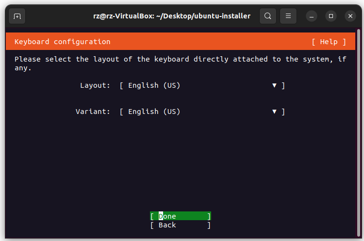

- Use the default settings and press "Done" to continue.

  

- Use the default settings and press "Done" to continue.

  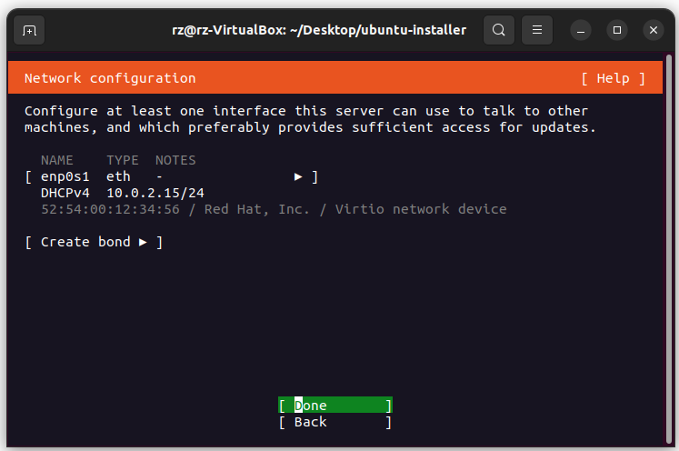

- Use the default settings and press "Done" to continue.

  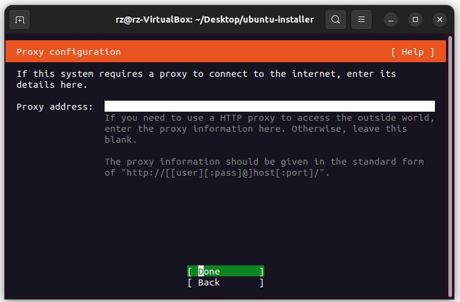

- Wait for the mirror location to be tested (see below), then press "Done" to continue.

  

- If the warning appears, press "Continue".

  

- Deselect "Set up this disk as an LVM group" and press "Done" to continue.

  

- Press "Done" to confirm the partitions of the "/dev/vdb" disk.

  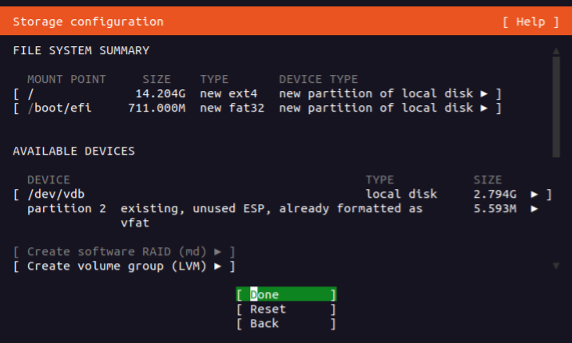

- Select "Continue" to finish partitioning and write changes to the "/dev/vdb" disk.

  

- Enter username (e.g., rvc) and password for the administrator account, then press "Done".

  

- Use the default settings and press "Continue".

  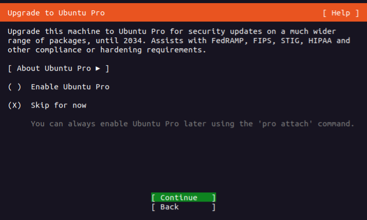

- Use the default settings and press "Done" to continue.

  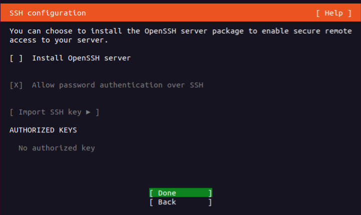

- Do not select any snap package. Press "Done" to continue.

  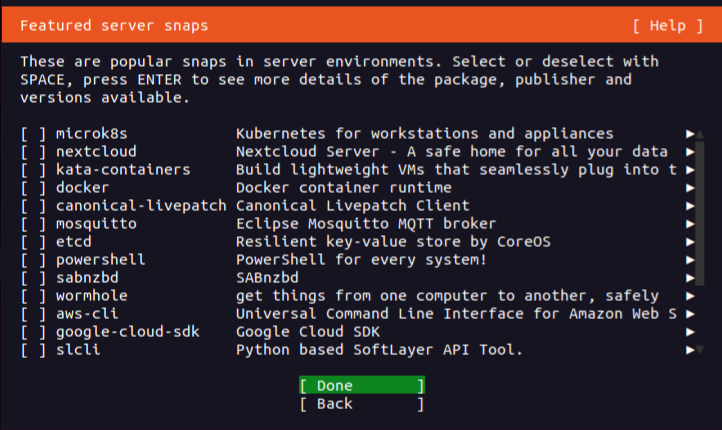

- Wait for the installation to finish.

  

- Press "Reboot Now" to exit the installer.

  

- After logging in, press Ctrl-A X to exit the VM.

  

## 5. Common issues

### 5.1 System hangs while preparing Ubuntu install

- If the installation stays on a screen like the one below for more than 10 minutes after selecting `Try or Install Ubuntu Server`, the system may hang.

  

- For workaround, please increase the value of the `-smp` option in the `run_qemu.sh` script (default is `-smp 2`). Just make sure the new value does not exceed the number of CPU cores on your machine.

### 5.2 Unable to download ISO file

- If the installer fails to download the ISO file, it may show an error message:

  

- For quick fix, find a valid URL for `ubuntu-24.04.3-live-server-arm64.iso` from the [Ubuntu old releases](https://old-releases.ubuntu.com/releases/noble/) or other trusted sources, then [update the value of ISO_URLS accordingly](#4251-iso_urls).

### 5.2 Missing bmap file causes slow write speed

- The installer uses .bmap file to accelerate the write speed when writing the image to external media. Without the .bmap file, it will fall back to nobmap mode, resulting in significantly slower write performance because the entire image must be written block by block.

  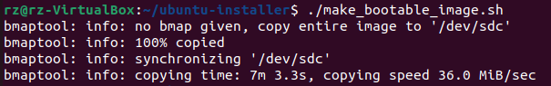

- When the image is compressed or transferred (e.g., uploaded to a server or shared with others), [its sparse regions (holes)](https://github.com/yoctoproject/bmaptool?tab=readme-ov-file#sparse-files) are filled with zeros. As a result, generating a new .bmap file afterward becomes meaningless and will no longer accelerate the write speed. To ensure fast writing and correct handling on other systems, always keep and distribute the image together with its corresponding .bmap file.
