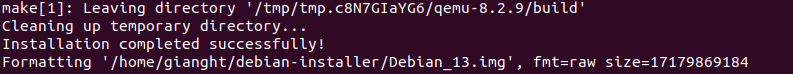
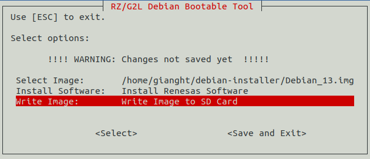
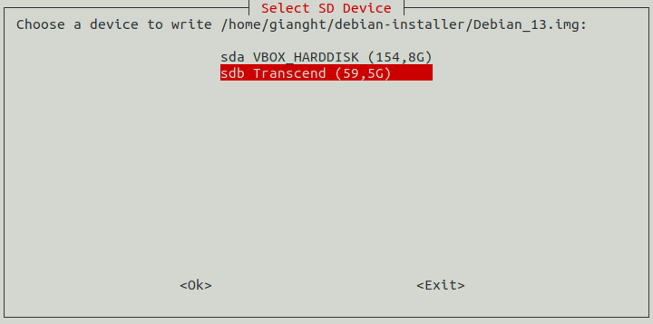
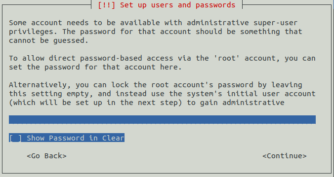

---
hide:
  - navigation
  - toc
---

# RZ/G2L Debian Bootable Tool

[Back to Getting Started >](../getting_started/index.md#step-4-create-a-bootable-microsd-card){ .md-button .btn-right }

## 1. Overview

The **RZ/G2L Debian Bootable Tool** is a Bash script designed to streamline the creation and customization of bootable ARM64 Linux disk images for Debian 13 on the RZ/G2L platform.

It offers a user-friendly, menu-based interface using `#!bash whiptail` and `#!bash zenity`, making it easy to create, manage disk images and apply custom configurations.

The tool also supports writing images directly to an SD card.

## 2. Objectives

- **Preparing The Image**:
    - Use an existing image or create a new 16GB image.
    - Download Debian 13 ARM64 ISO if it doesn't exist already.
    - Use QEMU to install Debian 13 from the ISO into the created image.

- **Install Software Packages**:
    - Install OSS (Open-source Software) packages including CIP kernel, GStreamer, MMNGR, VSPMIF.
    - Install HW Graphics packages (optional).
    - Install HW Codec packages (optional).

- **Write The Image**:
    - Select and write the image to an SD card.

## 3. Scripts Details

The bootable Linux image creation process is implemented as several small scripts for easy maintenance.
Here is the introduction and main functions.

- `#!bash make_bootable_tool.sh`: Contain the main menu selection.
- `#!bash install_qemu.sh`: Install QEMU version 8.2.9.
- `#!bash run_qemu.sh`: Start QEMU VM to install Debian 13 from the ISO into the image.
- `#!bash install_renesas_sw.sh`: Set up environment for chroot method to install software packages.
- `#!bash install_packages_debian.sh`: Install software packages inside a Debian chroot environment.
- `#!bash attach_sd.sh`: Write bootable image to SD card.
- `#!bash settings.txt`: Save previously used image names.

## 4. Usage

### 4.1 Prerequisites

- Ubuntu 22.04 LTS, and 24.04 LTS are supported.
- Internet connection is required.
- The `#!bash sudo` permission is required.
- 50GB+ available storage.
- 32GB+ microSD card.

### 4.2 How To Use Debian Installer

- Set the following environment:

    ```bash
    export DL_DIR=<A directory path where packages downloaded in step 3 are stored>
    export WORK_DIR=<A path to your working directory>
    ```
    {: .dollar }

- Create your working directory, and decompress packages:

    ```bash
    mkdir -p ${WORK_DIR}
    cd ${DL_DIR}
    unzip RTK0EF0045Z0031AZJ-v*.zip
    tar xf RTK0EF0045Z0031AZJ-v*/rz-debian-support-v*.tar.gz -C ${WORK_DIR}
    unzip RTK0EF0045Z0033AZJ-v*_EN.zip
    tar xf RTK0EF0045Z0033AZJ-v*_EN/rz-graphics-v*.tar.gz -C ${WORK_DIR}
    unzip RTK0EF0045Z0039AZJ-v*_EN.zip
    tar xf RTK0EF0045Z0039AZJ-v*_EN/rz-codecs-v*.tar.gz -C ${WORK_DIR}
    ```
    {: .dollar }


- Check your working directory:

    ```bash
    ls ${WORK_DIR}
    ```
    {: .dollar }

    You will see the following directories.

    ```bash
    bootloaders  installer  oss  rz-codecs  rz-graphics
    ```

- Execute `#!bash ./make_bootable_tool.sh` to open the GUI:

    ```bash
    cd ${WORK_DIR}/installer
    ./make_bootable_tool.sh
    ```
    {: .dollar }

- The main menu provides 3 options:
    - [**Select Image**](#421-select-image): Prepare an image with Debian 13 pre-installed.
    - [**Install Software**](#422-install-software): Install software packages on the image.
    - [**Write Image**](#423-write-image): Write the image to the SD card.

    

#### 4.2.1 Select Image

- Press ++enter++ on the **Select Image:** and select one of the two options below:

    - **1 Browse**: Select an image with Debian 13 pre-installed.
    - **2 Create New**: Create a new 16GiB image and install Debian 13 on it.

    

!!! note

    When you perform this process for the first time, you need to create a new image (**2 Create New**).
    You can use the created image next time (**1 Browse**).

- For the **1 Browse** option, use the file dialog to select the image (e.g., `#!bash Debian_13.img`). Next, press **OK** to confirm and skip to [Section 4.2.2](#422-install-software).

    

- For the **2 Create New** option, use the file dialog to name the image (e.g., `#!bash Debian_13.img`) and select its location. Next, press **OK** to confirm.

    

- Enter the administrator password. The tool will then download, build, and install QEMU version 8.2.9. If it's already installed, this step will be skipped.

    

- The tool will allocate and format `#!bash Debian_13.img`.

    

- The tool will download **Debian 13 ISO**. If it already exists in the `#!bash downloads` folder, this step will be skipped.

    

- The tool will use QEMU VM to install Debian 13 on `#!bash Debian_13.img`. Press "Ok" to continue.

    

- Follow installation instructions in [Section 4.3](#43-how-to-install-debian-13).

- If successful, the **Completed** dialog box will appear. Press **OK** to continue.

    

#### 4.2.2 Install Software

- Press Enter on the **Install Software:**.

    

- Enter the administrator password. The tool will then install all .deb packages into `Debian_13.img`.

    

- Wait for the **Success** dialog box. Press **OK** to continue.

    

#### 4.2.3 Write Image

- Plug in the microSD card to the Host PC.

- Press Enter on **Write Image:** to write `#!bash Debian_13.img` to the microSD card.

    

- Select the microSD card (e.g., `#!bash sdb Transcend (59,5G)`). Press **OK** to continue.

    

- Press **Proceed** to confirm.

    

- The tool will write `#!bash Debian_13.img` to `#!bash sdb Transcend (59,5G)`. Wait until 16GiB of data is written.

    

- If successful, the following dialog box will appear. Press **OK** to continue.

    

    

- Press **Save and Exit** to save the settings. Then press **OK** to exit.

    

    

    

- Execute `#!bash sudo eject /dev/sdb` to safely remove the microSD card from the Host PC.

### 4.3 How To Install Debian 13

- Press ++enter++ on **Install**.

    

- Press ++enter++ on **English**.

    

- Select your country, territory, or area (e.g., **United States**).

    

- Select your keyboard configuration (e.g., **American English**).

    

- Edit the hostname (e.g., **debian**), then press **Continue**.

    

- Enter the domain name, then press **Continue** (leave blank if not applicable).

    

- Set and verify the root password.

    

    

- Create a user account (e.g., **user**).

    

    

    

    

- Select your time zone (e.g., **Eastern**).

    

- Press ++enter++ on **Guided - use entire disk**.

    

- Press ++enter++ on **Virtual disk 1 (vda) - 17.2 GB Virtio Block Device**.

    

- Press ++enter++ on **All files in one partition (recommended for new users)**.

    

- Press ++enter++ on **Finish partitioning and write changes to disk**, then confirm with **Yes**.

    

    

- Press **Yes** to update the software using a network mirror.

    

- Select archive mirror country (e.g., **United States**).

    

- Press ++enter++ on **deb.debian.org**.

    

- Edit HTTP proxy information (leave blank if not applicable), then press **Continue**.

    

- Press **NO** to skip the package usage survey.

    

- Do not select any desktop environment. Press **Continue** to proceed.

    

- If successful, the **Installation complete** dialog box will appear. Click **Continue** to exit the installer.

    

- At GRUB interface, press ++ctrl+a+x++ to exit the VM.

    

[Back to Getting Started >](../getting_started/index.md#step-4-create-a-bootable-microsd-card){ .md-button .btn-right }
