---
hide:
  - navigation
  - toc
---

# RZ/G2L Ubuntu Bootable Tool

[Back to Getting Started >](../getting_started/index.md#step-4-create-a-bootable-microsd-card){ .md-button .btn-right }

## 1. Overview

The **RZ/G2L Ubuntu Bootable Tool** is a Bash script designed to streamline the creation and customization of bootable ARM64 Linux disk images for Ubuntu 24.04 on the RZ/G2L platform.

It offers a user-friendly, menu-based interface using `#!bash whiptail` and `#!bash zenity`, making it easy to create, manage disk images and apply custom configurations.

The tool also supports writing images directly to an SD card.

## 2. Objectives

- **Preparing The Image**:
    - Use an existing image or create a new 16GB image.
    - Download Ubuntu 24.04 ARM64 ISO if it doesn't exist already.
    - Use QEMU to install Ubuntu 24.04 from the ISO into the created image.

- **Install Software Packages**:
    - Install OSS (Open Source Software) packages including: CIP kernel, GStreamer, MMNGR, VSPMIF.
    - Install HW Graphics packges (optional).
    - Install HW Codec packges (optional).

- **Write The Image**:
    - Select and write the image to an SD card.

## 3. Scripts Details

Split into small scripts for easy maintenance. Here is the introduction and main functions.

- `#!bash make_bootable_tool.sh`: Contain the main menu selection.
- `#!bash install_qemu.sh`: Install QEMU version 8.2.9.
- `#!bash run_qemu.sh`: Start QEMU VM to install Ubuntu 24.04 from the ISO into the image.
- `#!bash install_renesas_sw.sh`: Set up environment for chroot method to install software packages.
- `#!bash install_packages_ubuntu.sh`: Install software packages inside a Ubuntu chroot environment.
- `#!bash attach_sd.sh`: Write bootable image to SD card.
- `#!bash settings.txt`: Save previously used image names.

## 4. Usage

### 4.1 Prerequisites

- Ubuntu 22.04 LTS, and 24.04 LTS are supported.
- Internet connection is required.
- The `#!bash sudo` permission is required.
- 50GB+ available storage.
- 32GB+ microSD card.

### 4.2 How To Use

- Set the following environment:

    ```bash
    export DL_DIR=<A directory path where packages downloaded in step 3 are stored>
    export WORK_DIR=<A path to your working directory>
    ```
    {: .dollar }

- Create your working directory, and decompress packages:

    ```bash
    mkdir -p ${WORK_DIR}
    cd ${DL_DIR}
    unzip RTK0EF0045Z0030AZJ-v*.zip
    tar xf RTK0EF0045Z0030AZJ-v*/rz-ubuntu-support-v*.tar.gz -C ${WORK_DIR}
    unzip RTK0EF0045Z0032AZJ-v*_EN.zip
    tar xf RTK0EF0045Z0032AZJ-v*_EN/rz-graphics-v*.tar.gz -C ${WORK_DIR}
    unzip RTK0EF0045Z0038AZJ-v*_EN.zip
    tar xf RTK0EF0045Z0038AZJ-v*_EN/rz-codecs-v*.tar.gz -C ${WORK_DIR}
    ```
    {: .dollar }

- Check your working directory:

    ```bash
    ls ${WORK_DIR}
    ```
    {: .dollar }

    You will see the following directories.

    ```bash
    bootloaders  installer  oss  rz-codecs  rz-graphics
    ```

- Run the main script:

    ```bash
    cd ${WORK_DIR}/installer
    ./make_bootable_tool.sh
    ```
    {: .dollar }

- The main menu provides 3 options:
    - [**Select Image**](#421-select-image): Prepare an image with Ubuntu 24.04 pre-installed.
    - [**Install Software**](#422-install-software): Install software packages to the image.
    - [**Write Image**](#423-write-image): Write the image to the SD card.

    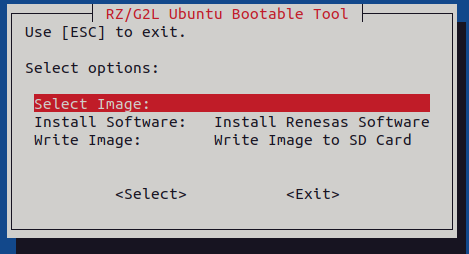

#### 4.2.1 Select Image

- Press ++enter++ on the **Select Image:** and select one of the two options below:

    - **1 Browse**: Select an image with Ubuntu 24.04 pre-installed.
    - **2 Create New**: Create a new 16GiB image and install Ubuntu 24.04 on it.

    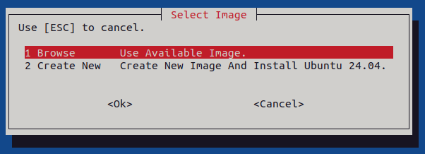

- For the **1 Browse** option, use the file dialog to select the image (e.g., `#!bash Linux.img`). Next, press **OK** to confirm and skip to [Section 4.2.2](#422-install-software).

    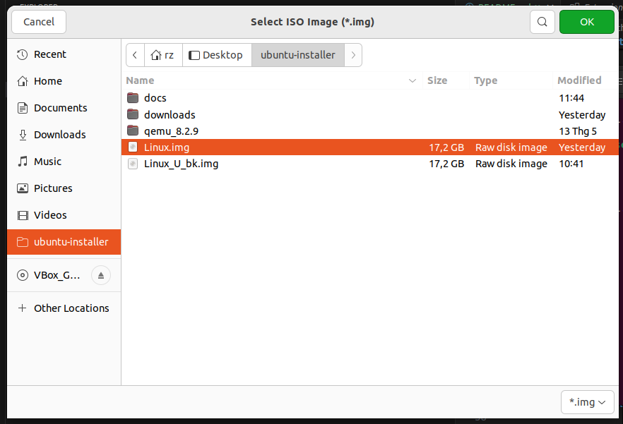

- For the **2 Create New** option, use the file dialog to name the image (e.g., `#!bash Linux.img`) and select its location. Next, press **OK** to confirm.

    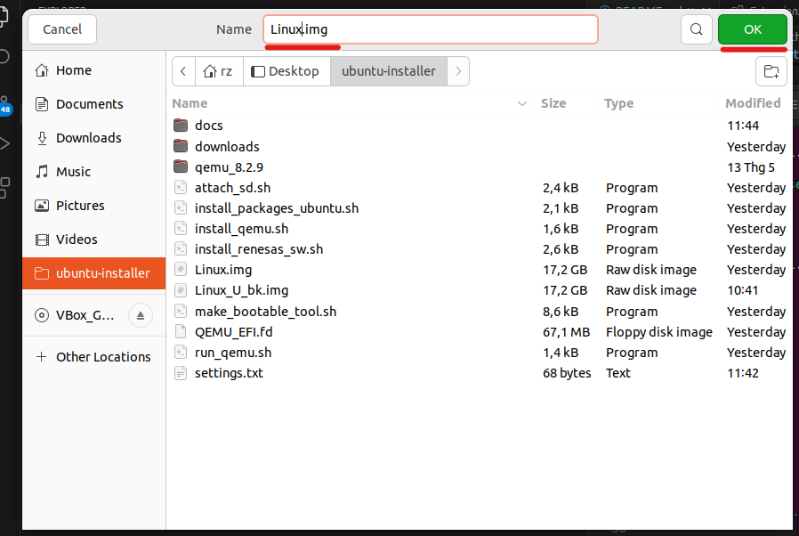

- Enter administrator password. The tool will then download, build, and install QEMU version 8.2.9. If it's already installed, this step will be skipped.

    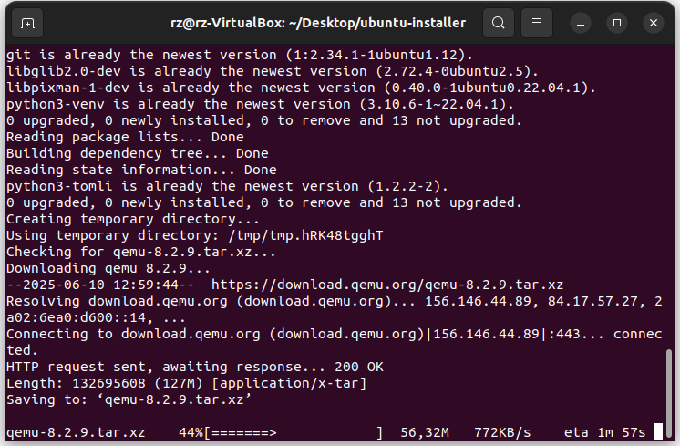

- The tool will allocate and format `#!bash Linux.img`.

    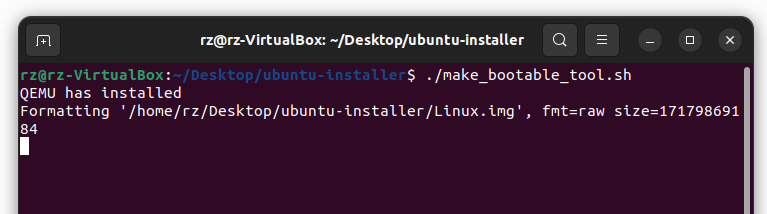

- The tool will download the Ubuntu 24.04 ISO. If it already exists in the `#!bash downloads` folder, this step will be skipped.

    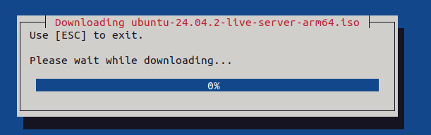
    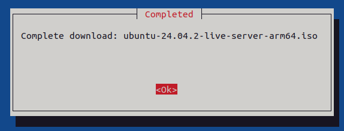

- The tool will use QEMU VM to install Ubuntu 24.04 to `#!bash Linux.img`. Press **OK** to continue.

    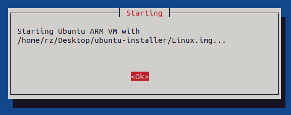

- Follow installation instructions in [Section 4.2.4](#424-how-to-install-ubuntu-2404).

- If successful, the **Completed** dialog box will appear. Press **OK** to continue.

    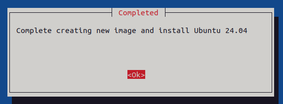

#### 4.2.2 Install Software

- Press ++enter++ on the **Install Software:**.

    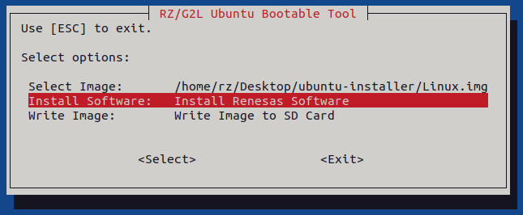

- The tool will install all .deb packages into `#!bash Linux.img`.

    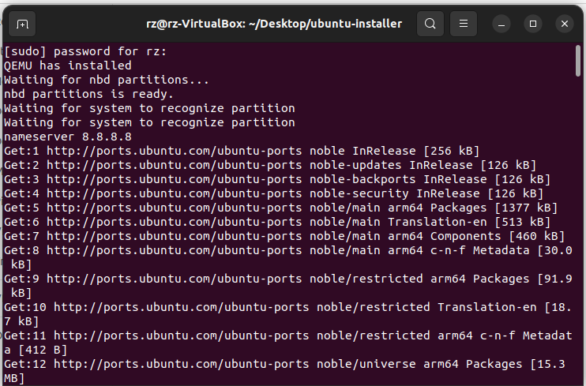

- Wait for the **Success** dialog box. Press **OK** to continue.

    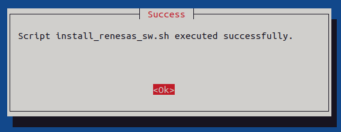

#### 4.2.3 Write Image

- Plug in the microSD card to the Host PC.

- In the main menu, press ++enter++ on **Write Image:** to write `#!bash Linux.img` to the microSD card.

    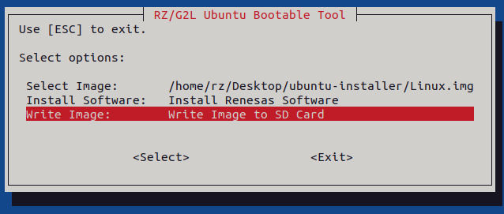

- Select the microSD card (e.g., `#!bash sdb Transcend (59,5G)`). Press **OK** to continue.

    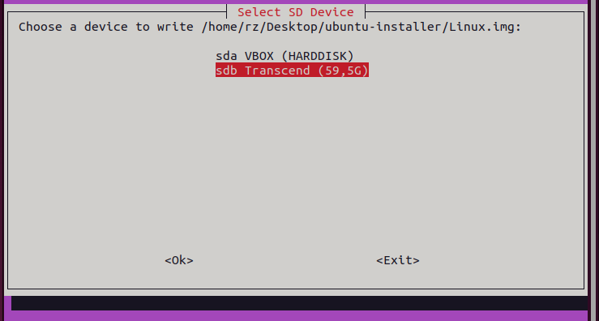

- Press **Proceed** to confirm.

    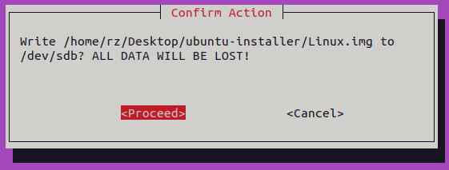

- The tool will write `#!bash Linux.img` to `#!bash sdb Transcend (59,5G)`.

    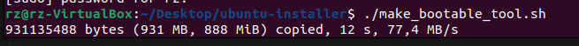

- If successful, the following dialog box will appear. Press **OK** to continue.

    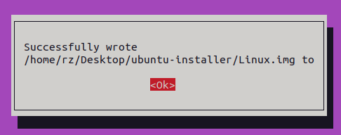

- Execute `#!bash sudo eject /dev/sdb` to safely remove the microSD card from the Host PC.

#### 4.2.4 How to install Ubuntu 24.04

- Press ++enter++ on **Try or Install Ubuntu Server**.

    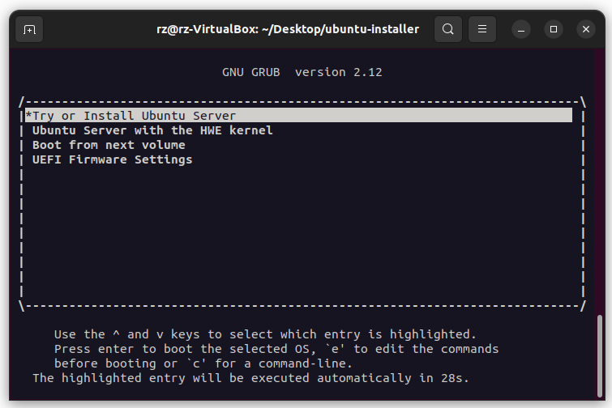

- Press ++enter++ on **Continue in rich mode**.

    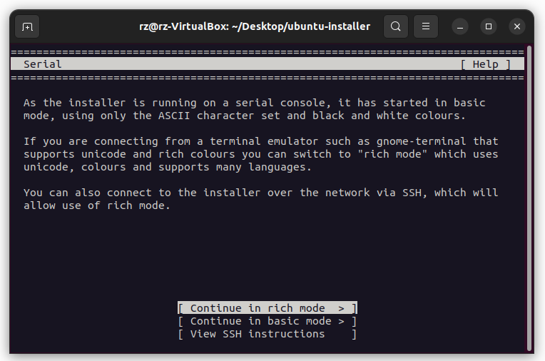

- Press ++enter++ on **English**.

    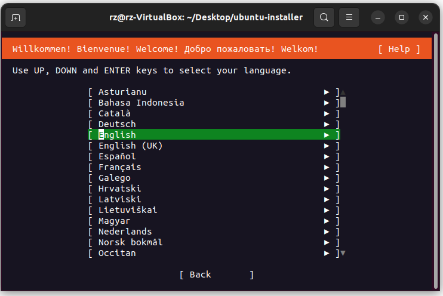

- Select your keyboard configuration (e.g., **English (US)**).

    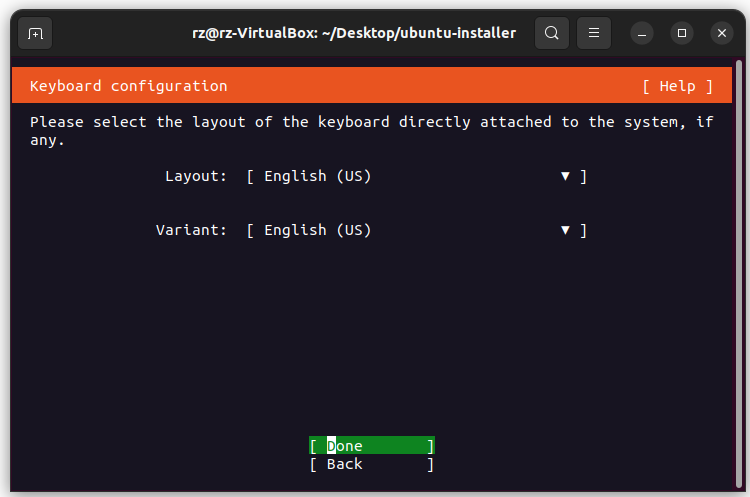

- Use the default settings and press ++enter++ to continue.

    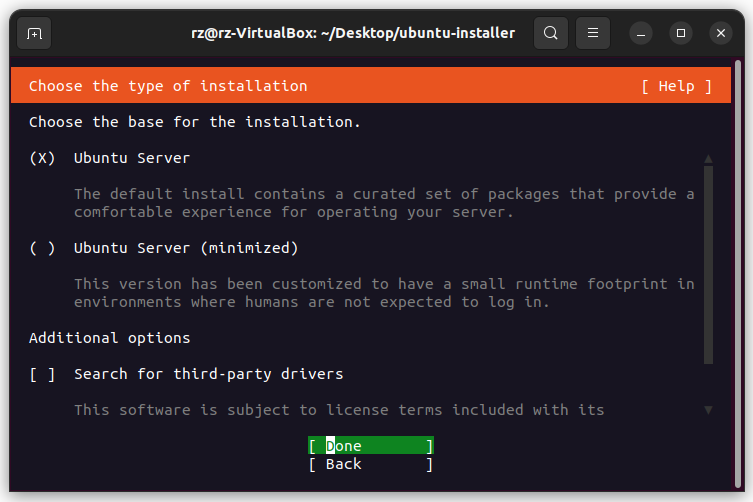

- Use the default settings and press ++enter++ to continue.

    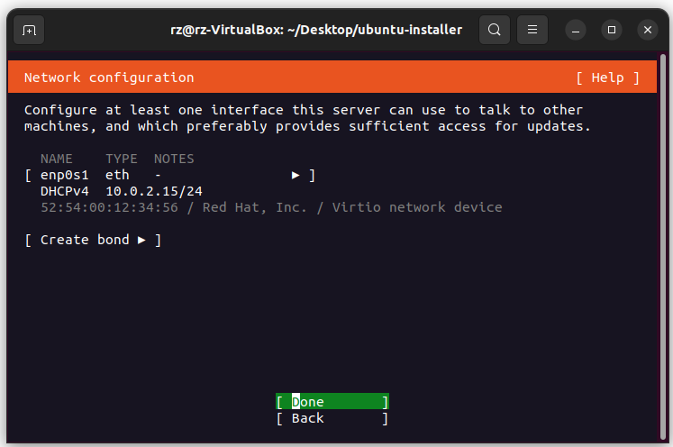

- Use the default settings and press ++enter++ to continue.

    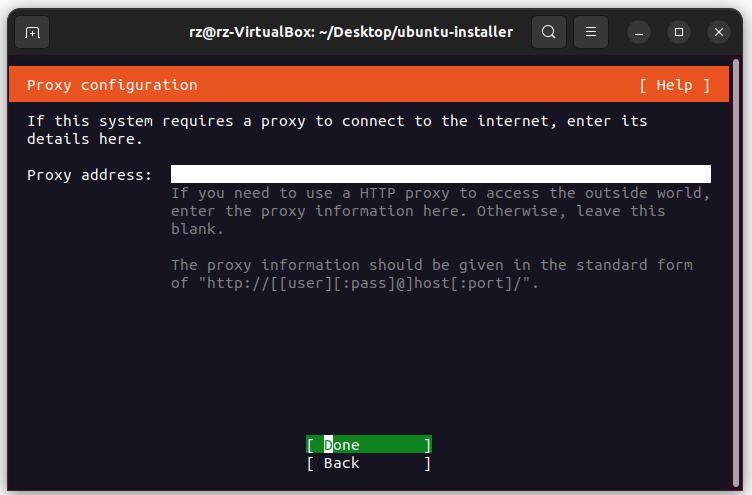

- Wait for the mirror location to be tested (see below), then press **Done** to continue.

    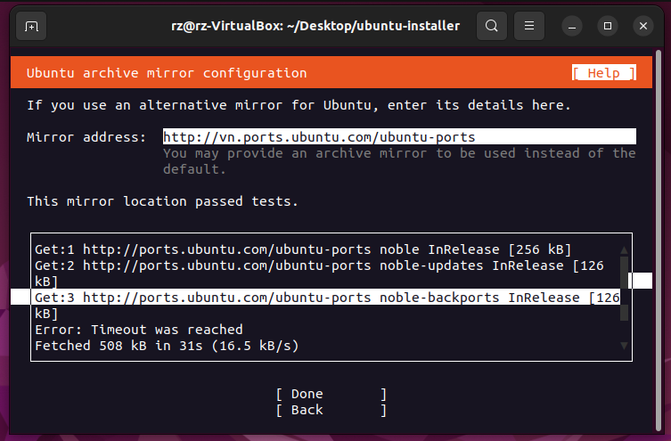

- Deselect **Set up this disk as an LVM group** and press **Done** to continue.

    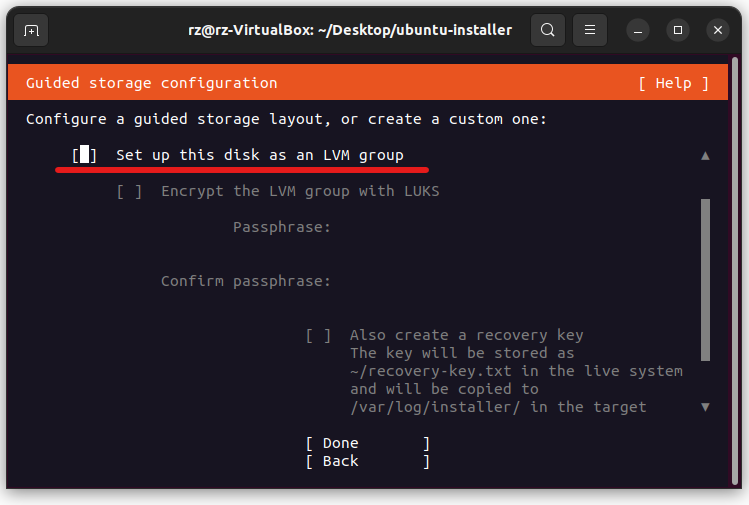

- Press ++enter++ to confirm the partitions of the **/dev/vdb** disk.

    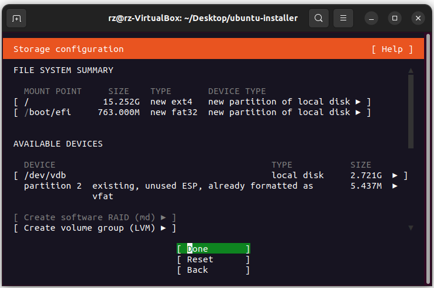

- Select **Continue** to finish partitioning and write changes to the **/dev/vdb** disk.

    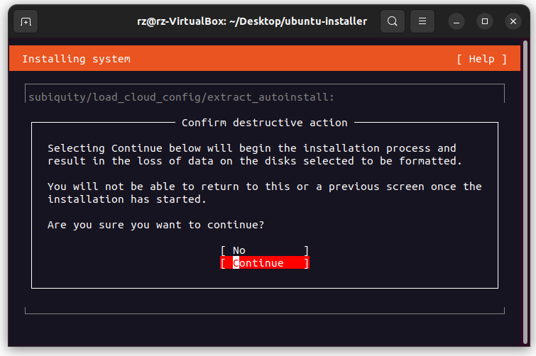

- Enter username (e.g., **user**) and password for the administrator account, then press **Done**.

    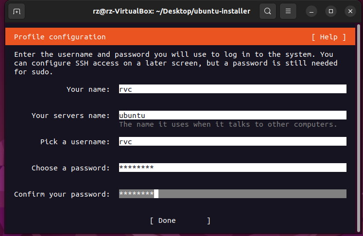

- Use the default settings and press ++enter++ to continue.

    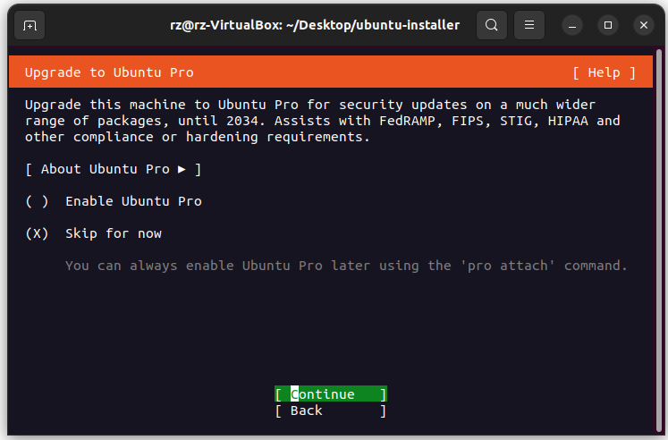

- Use the default settings and press **Done** to continue.

    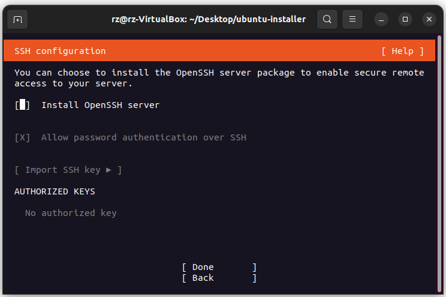

- Do not select any snap package. Press **Done** to continue.

    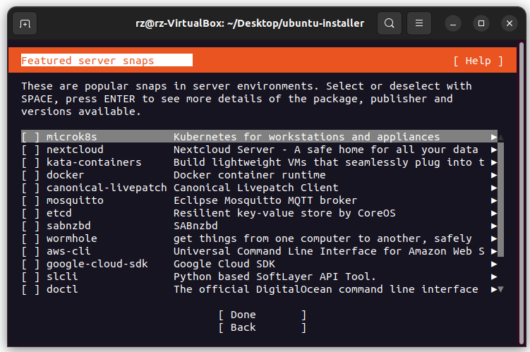

- Wait for the installation to finish.

    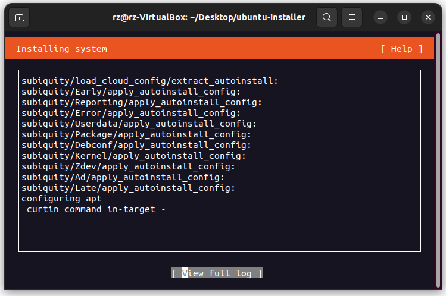

- Press **Reboot Now** to exit the installer.

    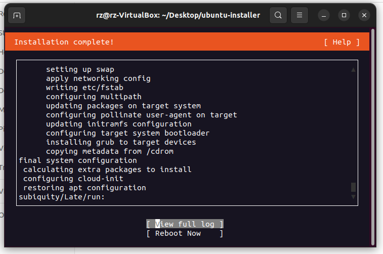

- Press ++ctrl+a+x++ to exit the VM.

[Back to Getting Started >](../getting_started/index.md#step-4-create-a-bootable-microsd-card){ .md-button .btn-right }
