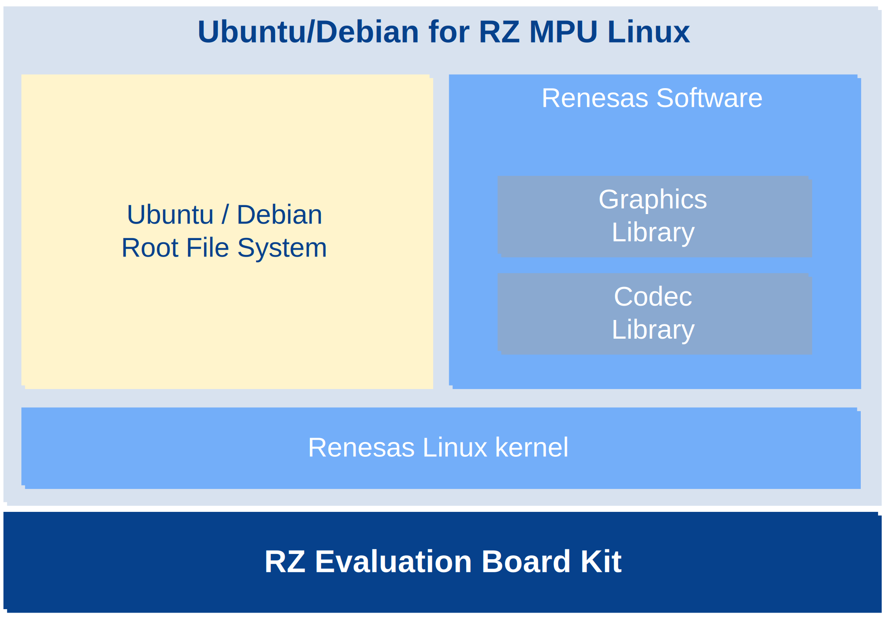

# Ubuntu and Debian for RZ MPU Linux

Ubuntu and Debian are the most popular Linux distributions used for PCs and servers.
They provide rich software ecosystems, and users can easily install the software over network.
{  align=right width=400 style=max-width:40%}

**Ubuntu and Debian for RZ MPU Linux** solution helps you to create Ubuntu/Debian environments on RZ MPU Evaluation Board Kit (EVK) for evaluation purposes.

* Free of charge
    * This solution provides information for creating Ubuntu/Debian environments free of charge.
    You can evaluate Ubuntu/Debian for free without a contract.
* Easy-to-use
    * This solution provides guides, software, and scripts for creating Ubuntu/Debian environments.
    You can easily create Ubuntu/Debian environments by using software and scripts.






